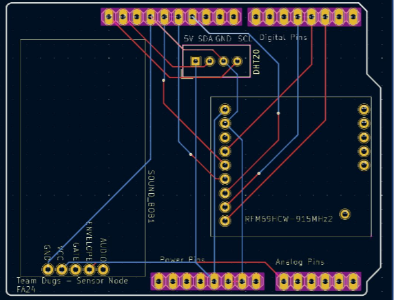
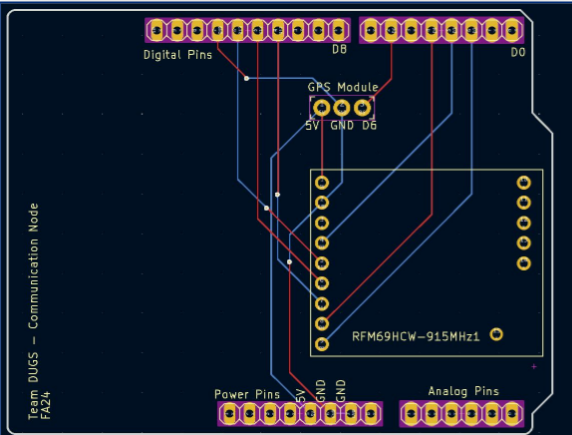
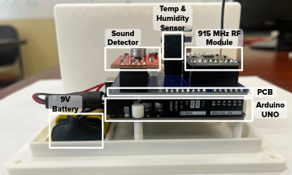
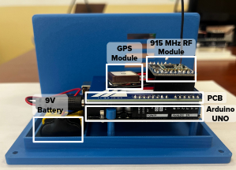
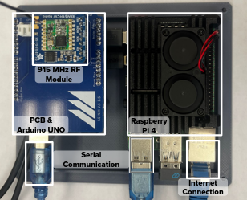

## Project Overview
This project implements **multihop, ad-hoc wireless sensor network (WSN)** for environmental monitoring. The system is built around Arduino UNO nodes that communicate using a 915 MHz transciever and a centeral gateway that handles requests and data storage. The gateway node requests temperature and humidity at sent intervals and collects sound data based on a monitored threshold. The network performs a discovery upon initialization which allows for ad-hoc distribution and supports multi-hop communication based on a path supplied by the gateway.

## Hardware
The system is built off of Arduino UNOs and custom PCB shields which integrate the RF transciever and sensors into the microcontroller.

<figure>
  
  <figcaption>Custom PCB for Sensor Nodes.</figcaption>
</figure>

<figure>
  
  <figcaption>Custom PCB for Communication and Gateway Nodes.</figcaption>
</figure>

## Node Types

The network is composed of three distinct node roles: **sensor nodes**, **communication nodes**, and a **gateway node**. All nodes share a common hardware and software base, with behavior determined by role-specific logic and sensors.

### Sensor Nodes
<figure>
  
  <figcaption>Assembled Sensor Node.</figcaption>
</figure>
Sensor nodes are responsible for collecting and reporting environmental data. These nodes interface with temperature, humidity, and sound sensors.

Sensor nodes:
- Respond to gateway-initiated requests for environmental or GPS data
- Participate in network discovery and routing
- Transmit sound data upon trigger
- Prioritize low-power operation during idle periods

### Communication Nodes
<figure>
  
  <figcaption>Assembled Communication Node.</figcaption>
</figure>
Communication nodes help in the routing and localization of the network.

Communication nodes:
- Participate fully in discovery and routing
- Forward packets between sensor nodes and the gateway
- Maintain routing state during the discovery phase
- Improve network robustness and multihop coverage
- Record GPS coordinates used in trilateration

### Gateway Node
<figure>
  
  <figcaption>Assembled Gateway Node.</figcaption>
</figure>
The gateway node serves as the **root of the network** and the primary interface between the WSN and external systems. The Arduino UNO is connected to a RasperryPi which handles the routing protocols and publishing of data.

The gateway:
- Initiates network discovery and route construction
- Requests environmental and GPS data from sensor nodes
- Receives asynchronous event-driven messages
- Aggregates data for storage in an external database
- Acts as the final destination for routed transmissions

## Network Architecture

The network operates as a **fully ad-hoc, multihop mesh**. Nodes do not rely on preconfigured routing tables; instead, routes are dynamically discovered during a **network setup (discovery) phase**.

The network supports both:
- **Request–response communication** initiated by the gateway (e.g., environmental or GPS data)
- **Asynchronous event-driven messages**, such as sound-triggered alerts that propagate back toward the gateway

## Discovery and Routing Algorithm
During the discovery process, the gateway node performs **Dijkstra’s algorithm** using the RSSI as the edge cost, a 32-bit integer is used to represent each node in the network where a 1 signals that it needs to be explored and a 0 signals that it already has been explored. This allows for a compact representation of 32 nodes, and the use of bitwise operations during the discovery process. The gateway node then stores a routing table, and upon request transmits the necessary path to the destination node. For the event based transmissions, each of the nodes stores the best path back to the gateway and transmits over this. The transmissions are handled using a baseline struct which is able to store the required data for each transmission type. The transmission is signified using an enum that specifies the type of tranmission and if it is a request or response. 

## Transmission Structure

```cpp
enum TransmissionType {
  DISCOVERY_REQUEST,
  GPS_REQUEST,
  ENV_SENSOR_REQUEST,
  DISCOVERY_RESPONSE,
  SOUND_RESPONSE,
  GPS_RESPONSE,
  ENV_SENSOR_RESPONSE,
  DISCOVERY_RESPONSE_FINISHED,
  WEIGHT_CALCS
};

/********* Transmission Struct ********/
struct TransmissionData{
    int dest;
    int curr_num_hops;
    int path[MAX_HOPS+1];
    float dataOne; // temp, latitude, RSSI
    float dataTwo; // humidity, longitude, timing
    TransmissionType dataType;
    uint32_t nodeClosedOpenEncoding; // 1 = node unvisited, 0 = visited
};
````

## Included in this repository
This repository includes the PCB design and all of the Arduino code required for the sensor, communication, and gateway nodes. Additional code is needed for the RaspberryPi to communicate with the gateway arduino. This is what handled the discovery process. 
